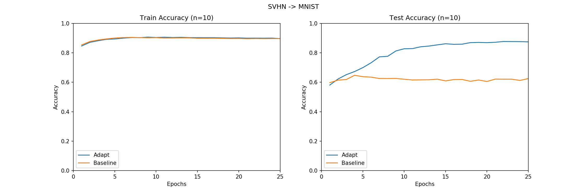

# Domain Adapataion with GANs

Some experiments with domain adaptation using GANs.


## Notebooks

Self-contained prototyping code. Everything else is designed to run on [Gypsum](https://gypsum-docs.cs.umass.edu/).

## Generate to Adapt

Implementation based on [1].

Get the datasets:
```bash
python3 scripts/download_GTA_datasets.py
```


Usage:
```bash
python3 -m GTA <args>

```



# References

[1] Sankaranarayanan, Swami, et al. "Generate to adapt: Aligning domains using generative adversarial networks." Proceedings of the IEEE Conference on Computer Vision and Pattern Recognition. 2018.